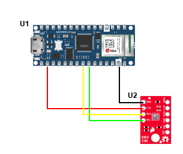

# Rain Prediction Model

This project uses machine learning to predict the likelihood of rain based on environmental data, including temperature, pressure, and altitude. It consists of four main Python scripts for training the model, performing inference, calculating evaluation metrics, and making live predictions from a sensor stream.

<div style="text-align: center;">
  
</div>


## Files Overview

### 1. `aTrainingModel.py`
This script:
- Loads two datasets: `RainyDay.csv` and `SunnyDay.csv`, located in the `aDataCollection/` directory.
- Prepares the data by adding a binary `Rain` column (1 for rainy, 0 for sunny), standardizes the features, and splits the data into training and test sets.
- Defines a feedforward neural network using PyTorch and trains it to predict rain based on the features `Temperature`, `Pressure`, and `Altitude`.
- Saves the trained model as `rain_prediction_model.pkl` and the scaler used for preprocessing as `scaler.pkl`.

### 2. `bInference.py`
This script:
- Loads the trained model (`rain_prediction_model.pkl`) and scaler (`scaler.pkl`).
- Accepts a sample input (test array) representing temperature, pressure, and altitude.
- Preprocesses the input using the saved scaler and makes a prediction using the trained model, outputting the predicted probability of rain.

### 3. `cMetrics.py`
This script:
- Loads the same datasets as in `aTrainingModel.py` and trains the rain prediction model.
- Evaluates the model using accuracy, precision, recall, and F1-score on the test set.
- Prints the metrics every 10 epochs during the training process.

### 4. `dLiveStreamPredict.py`
This script:
- Loads the trained model and scaler.
- Reads real-time data from a serial port (e.g., data from a BME280 sensor measuring temperature, pressure, and altitude).
- Preprocesses the live data and makes real-time predictions about the probability of rain, printing the result.

## How to Run

### 1. Training the Model
To train the model, ensure that the datasets `RainyDay.csv` and `SunnyDay.csv` are in the `aDataCollection/` directory. Then, run the following command:
```bash
python aTrainingModel.py
```

The trained model and scaler will be saved as `rain_prediction_model.pkl` and `scaler.pkl`, respectively.

### 2. Running Inference
To make predictions using the trained model, run:
```bash
python bInference.py
```
The script will use a predefined test sample to predict the probability of rain.

### 3. Evaluating the Model
To evaluate the model and print performance metrics, run:
```bash
python cMetrics.py
```
Metrics like accuracy, precision, recall, and F1-score will be calculated and printed every 10 epochs.

### 4. Live Stream Prediction
To make real-time predictions using data streamed from a sensor connected via serial, run:
```bash
python dLiveStreamPredict.py
```
Ensure that your serial port and sensor settings are correctly configured.

## Requirements

- Python 3.6+
- PyTorch
- scikit-learn
- numpy
- pandas
- joblib
- serial (for live stream predictions)

Install the dependencies using:
```bash
pip install torch scikit-learn pandas joblib numpy pyserial
```

## Directory Structure
```
.
├── aDataCollection/
│   ├── RainyDay.csv
│   └── SunnyDay.csv
├── aTrainingModel.py
├── bInference.py
├── cMetrics.py
├── dLiveStreamPredict.py
├── rain_prediction_model.pkl
├── scaler.pkl
└── README.md
```

## License
This project is licensed under the MIT License.

## Author
Edwin Nsoh Awariyah